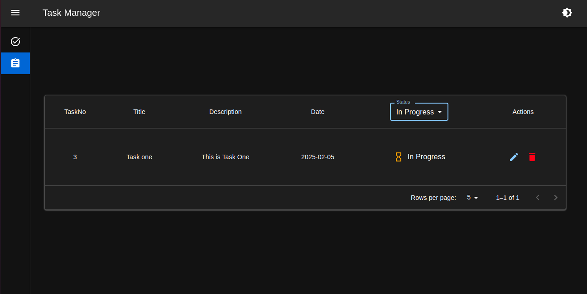

 # Task Managment

A brief description about the Project.


## Installation

Install my-project with npm

```bash
  npx create-react-app my-app --template typescript
```
 OR    
```bash
  npx create-react-app my-app --template typescript
```

```bash
  cd my-app
```

## Dependencies

The project relies on the following dependencies:

- **@mui/material**: Material UI core components for building the user interface.
- **@reduxjs/toolkit**: Redux Toolkit for managing global state.
- **react-redux**: React bindings for integrating Redux with React components.
- **axios**: Promise-based HTTP client for making API requests.
- **formik**: Form library for handling form state and validation.
- **yup**: Schema validation library used with Formik for form validation.
- **react-router-dom**: Library for handling routing in the app.
- **sonner**: Toast notifications library for showing in-app alerts.
- **json-server**: Fake REST API server for local development and mocking data..

- **`npm install`**: Installs all dependencies listed in `package.json`. This will include React, TypeScript, and any other libraries that were already added to the project.
- **`npm install <library-name>`**: Use this for installing any external libraries you need.
- **`@types/<library-name>`**: If you're using a library that requires TypeScript types, this is how you'd install them.


## Deployment

To start 

### Explanation:
- **`npm run dev`**: Starts the development server, allowing you to see the app running locally.

- **`npm run build`**: Creates an optimized production build of the app.

- **`npm run start:json-server`**: Starts the JSON server, which is helpful for mocking API requests during development.


## Features

- **Light/dark mode toggle**
- **Create Task**
- **View Task**
- **Edit Task**
- **Delete Task**
- **Sort Task Based on Status**
- **Pagination**


## Optimizations

- **Lazy Loading**
- **Code Splitting**
- **Efficient State Management with Redux Toolkit**
- **Responsive Design**
- **Higher Order Component**

## Tech Stack

**Client:** React, Redux Toolkit, TypeScript,Material Ui,Sonner

**Server:** Json Server

## Screenshots
- **Create Task & Light Mode**


<br/>

- **View Task & Dark Mode**


<br/>

- **Edit Task**


<br/>

- **Delete Task**


<br/>

- **Sort Task**

